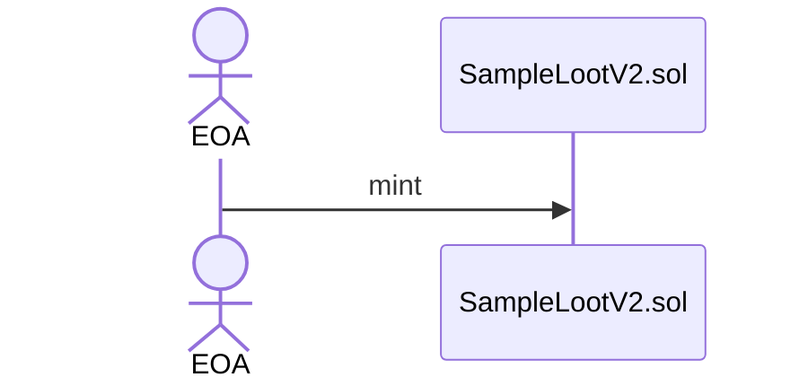
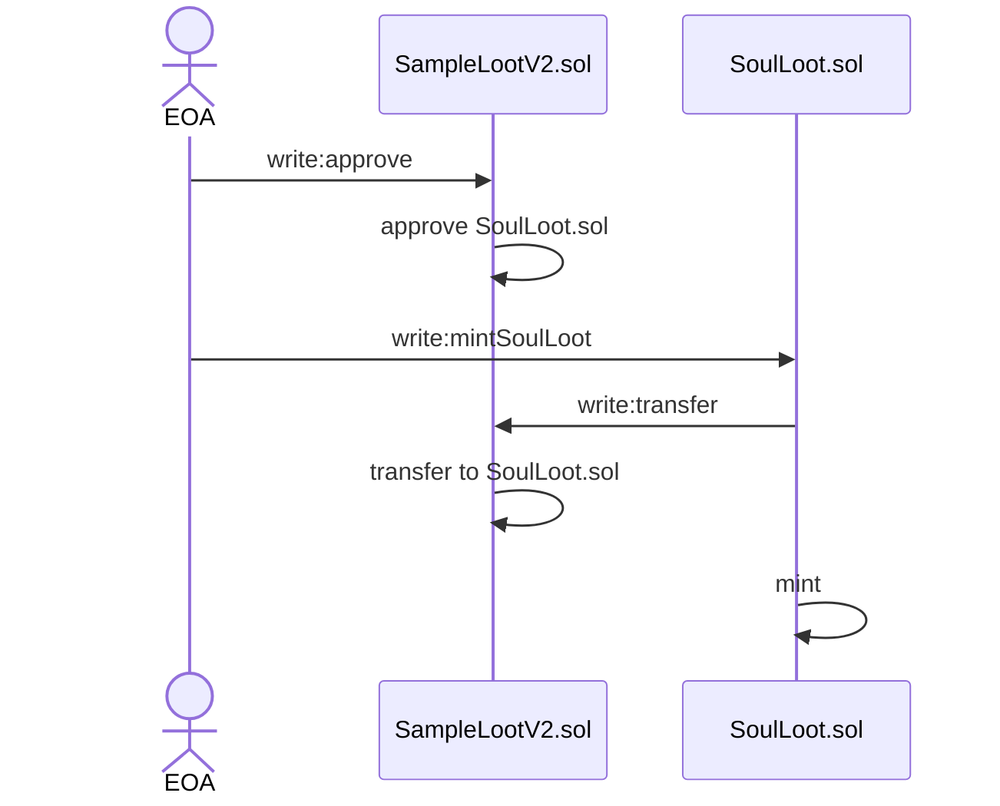
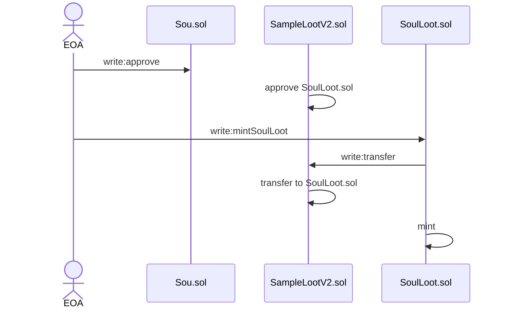

# 1.SampleLootのmint
* LootByRogueと同じ属性値を持つLootNftをmintする
## 処理フロー


## サンプルコード
[01_mint_sample_loot.ts](../10_contract/scripts/01_mint_sample_loot.ts)
```typescript
const [signer] = await ethers.getSigners();
console.log('Signer is ... ', signer.address);
const TOKEN_ID = 5;

const sampleLoot = new ethers.Contract(SAMPLE_LOOT, sampleLootAbi, signer);
const tx = await sampleLoot.approve(SOUL_LOOT, TOKEN_ID);
sampleLoot.once('Approval', (owner, to, tokenId) => {
    console.log('Approve from ', owner);
    console.log('To: ', to);
    console.log('Tokenid: ', tokenId.toString());
})
tx.wait();
```

# 2~3.SoulLootのmint
* TBA化するSoulLootをmintする
* 事前にSoulLoot.solに素材となるNFTのTransfer権限を与える

## 処理フロー

## サンプルコード
```typescript
const soulLoot = new ethers.Contract(SOUL_LOOT, soulLootAbi, signer);
soulLoot.once("mintSoulLoot", (from, to, tokenId, rAddress, rTokenId)=>{
    console.log('From: ', from);
    console.log('To: ', to);
    console.log('TokenID(Minted): ', tokenId.toString());
    console.log('root NFT Address: ', rAddress);
    console.log('root NFT TokenId: ', rTokenId.toString());
})
const tx = await soulLoot.safeMint(
    SAMPLE_LOOT,
    TOKEN_ID
);
tx.wait();
```


# 4.TBAの作成
* ユーザー（EOA）がERC6551Registryの実行
* TBAが作成される（ERC6551）
* 同時にEquipment, JOB, ArtifactのNFTがmintされ、TBAに付与される

## 処理フロー

## サンプルコード
```typescript
const soulLoot = new ethers.Contract(SOUL_LOOT, soulLootAbi, signer);
soulLoot.once("mintSoulLoot", (from, to, tokenId, rAddress, rTokenId)=>{
    console.log('From: ', from);
    console.log('To: ', to);
    console.log('TokenID(Minted): ', tokenId.toString());
    console.log('root NFT Address: ', rAddress);
    console.log('root NFT TokenId: ', rTokenId.toString());
})
const tx = await soulLoot.safeMint(
    SAMPLE_LOOT,
    TOKEN_ID
);
tx.wait();
```


# 5.EquipmentNftの装備
* EOA→TBAを経由して、 SoulControler.solのsetEquips関数を実行

# 6-7.EquipmentNftのLevel-up
* EOA→TBAを経由して、LaXp.solのapprove関数を実行（ SoulControlerをApprove）
* EOA→TBAを経由して、SoulControler.solのlevelUp関数を実行（この時、LaXpトークンが支払われる）

# 8-9.ゲームプレイ〜装備NFTの消去
* EOA→TBAを経由して、SoulControler.solのsetNftsOngame関数を実行
* ダンジョン完了後、Equipmentを没収
  * コントラクト上で没収するEquipmentを算出する 
  * 運営が、EquipmentNft.solのsafeTransferFrom関数を実行し、トレジャリーにEquipmentを送る

# 10.ゲーム完了
* 運営が、SoulControler.solのsetNftsOffGame関数を実行