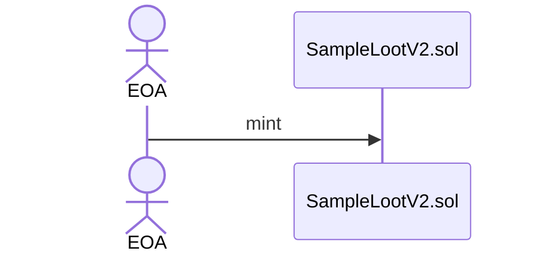

# 1.SampleLootのmint
* LootByRogueと同じ属性値を持つLootNftをmintする
## 処理フロー


## サンプルコード
[01_mint_sample_loot.ts](../10_contract/scripts/01_mint_sample_loot.ts)
```typescript
const sampleLoot = new ethers.Contract(SAMPLE_LOOT, sampleLootAbi, signer);
  const tx = await sampleLoot.approve(SOUL_MINTER, TOKEN_ID);
  sampleLoot.once('Approval', (owner, to, tokenId) => {
    console.log('Approve from ', owner);
    console.log('To: ', to);
    console.log('Tokenid: ', tokenId.toString());
  })

  tx.wait();
```

# 2~3.SoulLootのmint
* TBA化するSoulLootをmintする
* 事前にSoulLoot.solに素材となるNFTのTransfer権限を与える

## 処理フロー
(1) Approve ~ CreateTBA
```mermaid
sequenceDiagram
    actor EOA
    EOA ->> SampleLootV2.sol: w:approve
    SampleLootV2.sol ->> SampleLootV2.sol: approve SoulLoot.sol
    EOA ->> SoulMinter.sol:  w:mintSoul
    
    SoulMinter.sol ->> (calc)LootByRogueV2: r:calcSoul
    (calc)LootByRogueV2 -->> SoulMinter.sol: AdventureRecord
    SoulMinter.sol ->> SoulLootNft.sol: w:safeMint
    SoulLootNft.sol ->> SoulLootNft.sol: mint SoulLoot
    SoulLootNft.sol --> EOA: event Transfer

    SoulMinter.sol ->> LootByRogueV2.sol: w:transferFrom
    LootByRogueV2.sol ->> LootByRogueV2.sol: transfer EOA to ZERO
    LootByRogueV2.sol --> EOA: event Transfer

    SoulMinter.sol ->> ERC6551Registry.sol: w:createAccount
    ERC6551Registry.sol ->> ERC6551Registry.sol: CreateV2
    ERC6551Registry.sol --> EOA: AccountCreated
```
(2)mint Equipment/Artifact/Job
```mermaid
sequenceDiagram
    actor EOA
    SoulMinter.sol ->> (calc)LootByRogueV2: r:calcEquipment
    (calc)LootByRogueV2 -->> SoulMinter.sol: Parameters
    SoulMinter.sol ->> Equipment.sol: w:safeMint
    Equipment.sol ->> Equipment.sol: mint SoulLoot
    Equipment.sol--> EOA: event Transfer

    SoulMinter.sol ->> (calc)LootByRogueV2: r:calcArtifact
    (calc)LootByRogueV2 -->> SoulMinter.sol: Parameters
    SoulMinter.sol ->> Artifact.sol: w:safeMint
    Artifact.sol ->> Artifact.sol: mint SoulLoot
    Artifact.sol--> EOA: event Transfer

    SoulMinter.sol ->> (calc)LootByRogueV2: r:calcJob
    (calc)LootByRogueV2 -->> SoulMinter.sol: Parameters
    SoulMinter.sol ->> Job.sol: w:safeMint
    Job.sol ->> Job.sol: mint SoulLoot
    Job.sol--> EOA: event Transfer
```

## サンプルコード
```typescript
const soulMinter = new ethers.Contract(SOUL_MINTER, soulMinterAbi, signer);
const tx = await soulMinter.mintSoul(
    420,
    SAMPLE_LOOT,
    TOKEN_ID,
    '0x0000000000000000000000000000000000000000'
  );
  tx.wait();
```


# 5.EquipmentNftの装備
* EOA→TBAを経由して、 SoulControler.solのsetEquips関数を実行

# 6-7.EquipmentNftのLevel-up
* EOA→TBAを経由して、LaXp.solのapprove関数を実行（ SoulControlerをApprove）
* EOA→TBAを経由して、SoulControler.solのlevelUp関数を実行（この時、LaXpトークンが支払われる）

# 8-9.ゲームプレイ〜装備NFTの消去
* EOA→TBAを経由して、SoulControler.solのsetNftsOngame関数を実行
* ダンジョン完了後、Equipmentを没収
  * コントラクト上で没収するEquipmentを算出する 
  * 運営が、EquipmentNft.solのsafeTransferFrom関数を実行し、トレジャリーにEquipmentを送る

# 10.ゲーム完了
* 運営が、SoulControler.solのsetNftsOffGame関数を実行