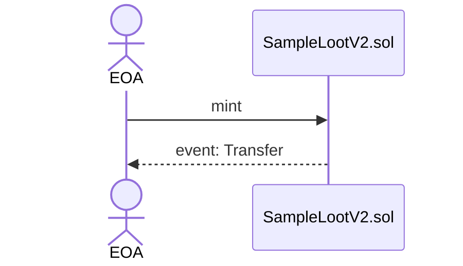
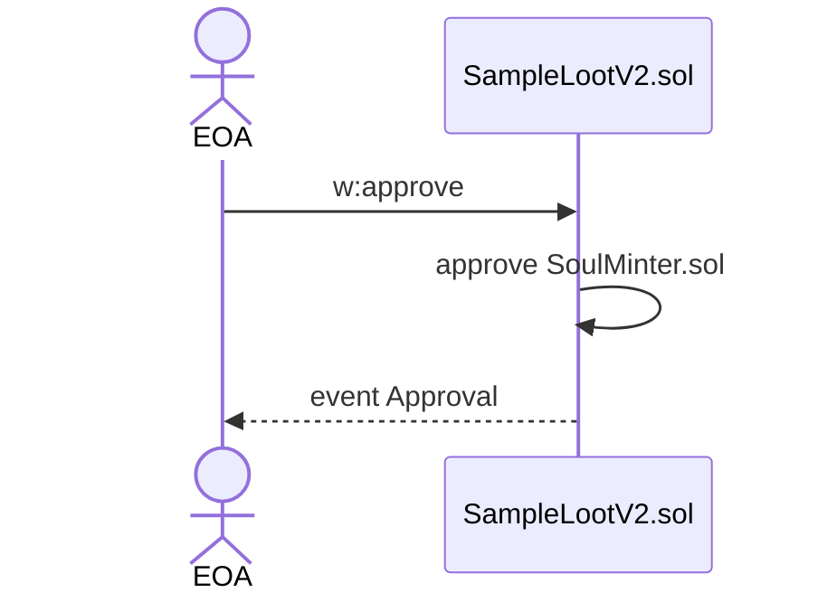
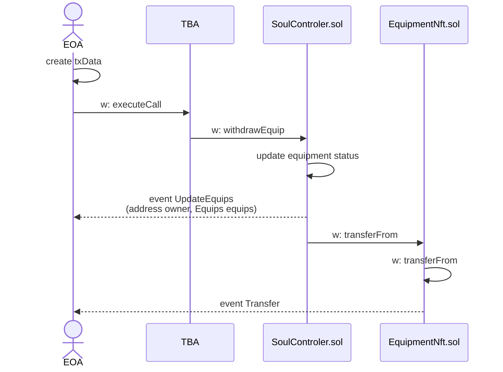
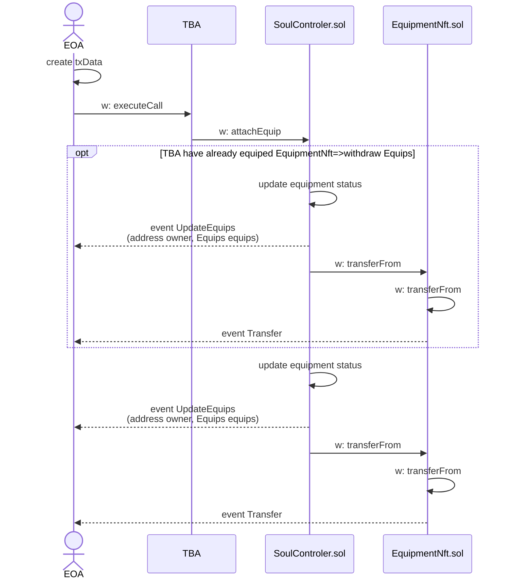

# 1.SampleLootのmint
* LootByRogueと同じ属性値を持つLootNftをmintする
## 処理フロー


## 実行コード
* EOAからSampleLootV2.solのsafeMintTemp関数を実行する
* 引数によって、rLootの値を指定
```solidity
function safeMintTemp(
  address to, 
  uint256 _seed,
  uint16 _turn,
  uint16 _maxHp,
  uint16 _currentHp,
  uint16 _attack,
  uint16 _defence,
  uint16 _recovery,
  uint16[6] memory  _stats,
  uint8[4] memory _unique,
  uint256 _weapon,
  uint256 _chestArmor,
  uint256 _headArmor,
  uint256 _waistArmor,
  uint256 _footArmor,
  uint256 _handArmor,
  uint256 _necklace,
  uint256 _ring,
  uint256[] memory _relics // Enemies
) public {
  AdventureRecord memory tmpRecord;
  tmpRecord.inputData.seed = _seed;
  tmpRecord.turn = _turn;
  tmpRecord.maxHp = _maxHp;
  tmpRecord.currentHp = _currentHp;
  tmpRecord.attack = _attack;
  tmpRecord.defence = _defence;
  tmpRecord.recovery = _recovery;
  tmpRecord.stats = _stats;
  tmpRecord.unique = _unique;
  tmpRecord.weapon = _weapon;
  tmpRecord.chestArmor = _chestArmor;
  tmpRecord.headArmor = _headArmor;
  tmpRecord.waistArmor = _waistArmor;
  tmpRecord.footArmor = _footArmor;
  tmpRecord.handArmor = _handArmor;
  tmpRecord.necklace = _necklace;
  tmpRecord.ring = _ring;
  tmpRecord.relics = _relics;

  mintedSeed[tmpRecord.inputData.seed] = true;
  
  uint256 tokenId = _tokenIdCounter.current();
  tokens[tokenId] = tmpRecord;

  _safeMint(to, tokenId);
  emit MintSeed(msg.sender, tokenId, tmpRecord.inputData.seed);
  _tokenIdCounter.increment();
}
```

## サンプルコード
[01_mint_sample_loot.ts](../10_contract/scripts/01_mint_sample_loot.ts)
```typescript
const sampleLoot = new ethers.Contract(SAMPLE_LOOT, sampleLootAbi, signer);
  const tx = await sampleLoot.approve(SOUL_MINTER, TOKEN_ID);
  sampleLoot.once('Approval', (owner, to, tokenId) => {
    console.log('Approve from ', owner);
    console.log('To: ', to);
    console.log('Tokenid: ', tokenId.toString());
  })

  const tx = await sampleLoot.safeMintTemp(
    signer.address,
    10001,
    10,11,12,13,14,15,
    [1,2,3,4,5,6],[1,2,3,4],
    1,1,1,1,1,1,1,1,
    [1,1,1]
  );
  tx.wait();
```

# 2.SoulLootのmintに向けたApprove
* 手順3に向けて、SoulMinter.solへrLootの操作権限を付与

## 処理フロー

## 実行コード
* ERC721のapprove関数

## サンプルコード
[02_approve_sample.ts](../10_contract/scripts/02_approve_sample.ts)
```typescript
const sampleLoot = new ethers.Contract(SAMPLE_LOOT, sampleLootAbi, signer);
sampleLoot.once('Approval', (owner, to, tokenId) => {
  console.log('Approve from ', owner);
  console.log('To: ', to);
  console.log('Tokenid: ', tokenId.toString());
})
const tx = await sampleLoot.approve(SOUL_MINTER, TOKEN_ID);
```
# 3.SoulLootのmint, TBAの作成, Equipment/Artifact/Jobのmint
* TBA化するSoulLootをmintする
* 事前にSoulLoot.solに素材となるNFTのTransfer権限を与える

## 処理フロー
(1) Approve ~ CreateTBA
```mermaid
sequenceDiagram
    actor EOA
    EOA ->> SoulMinter.sol:  w:mintSoul
    
    SoulMinter.sol ->> (calc)LootByRogueV2: r:calcSoul
    (calc)LootByRogueV2 -->> SoulMinter.sol: AdventureRecord
    SoulMinter.sol ->> SoulLootNft.sol: w:safeMint
    SoulLootNft.sol ->> SoulLootNft.sol: mint SoulLoot
    SoulLootNft.sol -->> EOA: event Transfer

    SoulMinter.sol ->> LootByRogueV2.sol: w:transferFrom
    LootByRogueV2.sol ->> LootByRogueV2.sol: transfer EOA to ZERO Address
    LootByRogueV2.sol -->> EOA: event Transfer

    SoulMinter.sol ->> ERC6551Registry.sol: w:createAccount
    ERC6551Registry.sol ->> ERC6551Registry.sol: CreateV2
    ERC6551Registry.sol -->> EOA: AccountCreated
```
(2)mint Equipment/Artifact/Job
```mermaid
sequenceDiagram
    actor EOA
    SoulMinter.sol ->> (calc)LootByRogueV2: r:calcEquipment
    (calc)LootByRogueV2 -->> SoulMinter.sol: Parameters
    SoulMinter.sol ->> EquipmentNft.sol: w:safeMint
    EquipmentNft.sol ->> EquipmentNft.sol: mint SoulLoot
    EquipmentNft.sol-->> EOA: event Transfer
    SoulMinter.sol ->> EquipmentNft.sol: w: setApprovalForAll
    EquipmentNft.sol ->> EquipmentNft.sol: w: approve to SoulControler.sol
    EquipmentNft.sol-->> EOA: event Approval

    SoulMinter.sol ->> (calc)LootByRogueV2: r:calcArtifact
    (calc)LootByRogueV2 -->> SoulMinter.sol: Parameters
    SoulMinter.sol ->> Artifact.sol: w:safeMint
    Artifact.sol ->> Artifact.sol: mint SoulLoot
    Artifact.sol-->> EOA: event Transfer

    SoulMinter.sol ->> (calc)LootByRogueV2: r:calcJob
    (calc)LootByRogueV2 -->> SoulMinter.sol: Parameters
    SoulMinter.sol ->> Job.sol: w:safeMint
    Job.sol ->> Job.sol: mint SoulLoot
    Job.sol-->> EOA: event Transfer
```

## 実行コード
* EOAから、soulMinter.solのmintSoul関数を実行
* rLootのNFT情報を引数で指定
  * chainId_：チェーンID
  * nft_：rLootのコントラクトアドレス
  * tokenId_：rLootのトークンID
  * 任意の値：将来的に利用予定。現在は未使用
```solidity
function mintSoul(
  uint256 chainId_,
  address nft_, 
  uint256 tokenId_,
  bytes memory seedData_
) public {
  IERC721 _nft = IERC721(nft_);
  require(_nft.ownerOf(tokenId_)==msg.sender, 'SoulMinter Error: You are not NFT owner');
  ISoulLoot _soulLoot = ISoulLoot(soulLoot);
  IERC6551Registry _registry = IERC6551Registry(erc6551Registry);
  ILootByRogueV2 _loot = ILootByRogueV2(nft_);
  
  ISoulCalculator _calc = ISoulCalculator(calcContract[nft_]);
  (ILootByRogueV2.AdventureRecord memory _record) = _calc.calcSoul(nft_, tokenId_, seedData_);

  // Mint SoulLoot to EOA
  _soulLoot.safeMint(msg.sender, chainId_, nft_, tokenId_, _record);
  _loot.safeTransferFrom(msg.sender, ZERO_ADDRESS, tokenId_);

  // Create TBA
  uint256 _tokenId = _soulLoot.getTokenId(tokenId_, nft_);
  _registry.createAccount(implementation, chainId_, soulLoot, _tokenId, 1, '0x0000000000000000000000000000000000000000');
  address _tba = _registry.account(
      implementation, 
      chainId_, 
      soulLoot, 
      _tokenId,
      1
  );
  // Mint Equipmnt&Job&Artifact to TBA
  _mintEquipmentNft(nft_, tokenId_, _tba, seedData_);
  _mintJobNft(nft_, tokenId_, _tba, seedData_);
  _mintArtifactNft(nft_, tokenId_, _tba, seedData_);
}
```

## サンプルコード
```typescript
const soulMinter = new ethers.Contract(SOUL_MINTER, soulMinterAbi, signer);
const tx = await soulMinter.mintSoul(
  420,
  SAMPLE_LOOT,
  TOKEN_ID,
  '0x0000000000000000000000000000000000000000'
);
tx.wait();
```

# 4.装備NFTの引き出し
* TBAに装備されているEquipmentNftを、TBAの持ち主であるEOAが引き出す

## 処理フロー


## 実行コード
* TBAからsoulControlerのwithdrawEquip関数を実行
* EOAにて上記関数のTxデータを作成し、TBAのexecuteCall関数を実行
soulControler
```solidity
function _withdrawEquip(
  address eoa_,
  address tba_,
  uint256 type_
) private {
  IEquipmentNft _equipmentNft = IEquipmentNft(equipmentNft);
  uint256 _tokenId = 0;
  Equips memory _equip = equips[tba_];
  if(type_==0){
      _tokenId = _equip.weapon;
      _equip.weapon = 0;
  } else if(type_==1){
      _tokenId = _equip.cheastArmor;
      _equip.cheastArmor = 0;
  } else if(type_==2){
      _tokenId = equips[tba_].headArmor;
      _equip.headArmor = 0;
  } else if(type_==3){
      _tokenId = equips[tba_].waistArmor;
      _equip.waistArmor = 0;
  } else if(type_==4){
      _tokenId = equips[tba_].footArmor;
      _equip.footArmor = 0;
  } else if(type_==5){
      _tokenId = equips[tba_].handArmor;
      _equip.handArmor = 0;
  } else if(type_==6){
      _tokenId = equips[tba_].necklace;
      _equip.necklace = 0;
  } else if(type_==7){
      _tokenId = equips[tba_].ring;
      _equip.ring = 0;
  }

  require(_tokenId!=0, 'SoulControler | You do not set this Equipment-Type');
  equips[tba_]=_equip;
  _equipmentNft.safeTransferFrom(tba_, eoa_, _tokenId, 1, '0x00');
}
...

function withdrawEquip(
  address eoa_,
  uint256 tokenId_
) public {
  IEquipmentNft _equipment = IEquipmentNft(equipmentNft);
  require(_equipment.balanceOf(msg.sender, tokenId_)>0, 'SoulControler | You are not EquipmentNft owner');
  uint256 _type = _equipment.getEquipmentType(tokenId_);
  _withdrawEquip(eoa_, msg.sender, _type);
  emit UpdateEquips(msg.sender, equips[msg.sender]);
}
```
Token Bound Account (ERC6551Account.sol)
```solidity
function executeCall(
    address to,
    uint256 value,
    bytes calldata data
) external payable returns (bytes memory result) {
    require(msg.sender == owner(), "Not token owner");
    bool success;
    (success, result) = to.call{value: value}(data);
    if (!success) {
        assembly {
            revert(add(result, 32), mload(result))
        }
    }
    _nonce++;
}
```

## サンプルコード
```typescript
// create tx data
const txData = soulControler.interface.encodeFunctionData("withdrawEquip", [
  signer.address,
  20000000001000
]);

const tx = await tbaContract.executeCall(SOUL_CONTROLER, 0, txData);
tx.wait();
```

# 6. 装備NFTの装備
## 処理フロー


## 実行コード
* EOAからsoulControlerのwithdrawEquip関数を実行
* 既にTBAが該当の装備タイプのEquipmentNFTを所持している場合は、既に装備済みの EquipmentNFTをEOAへ送付する
```solidity
function _attachEquip(
  uint256 tokenId_,
  address tba_,
  uint256 type_
) private {
  if(type_==0){
    equips[tba_].weapon = tokenId_;
  } else if(type_==1){
    equips[tba_].cheastArmor = tokenId_;
  } else if(type_==2){
    equips[tba_].headArmor = tokenId_;
  } else if(type_==3){
    equips[tba_].waistArmor = tokenId_;
  } else if(type_==4){
    equips[tba_].footArmor = tokenId_;
  } else if(type_==5){
    equips[tba_].handArmor = tokenId_;
  } else if(type_==6){
    equips[tba_].necklace = tokenId_;
  } else if(type_==7){
    equips[tba_].ring = tokenId_;
  }
}

function attachEquip(
  uint256 tokenId_,
  address tba_
) public {
  IEquipmentNft _equipment = IEquipmentNft(equipmentNft);
  require(_equipment.balanceOf(msg.sender, tokenId_)>0, 'SoulControler | You are not EquipmentNft owner');
  uint256 _type = _equipment.getEquipmentType(tokenId_);
  if(getIsEquip(tba_, _type)){
      _withdrawEquip(msg.sender, tba_, _type);
  }
  _equipment.safeTransferFrom(msg.sender, tba_, tokenId_, 1, '0x00');
  _attachEquip(tokenId_, tba_, _type);
  emit UpdateEquips(tba_, equips[tba_]);
  }
```

## サンプルコード
```typescript
const tx = await soulControler.attachEquip(
  20000020001000,
  tba
);
tx.wait();
```